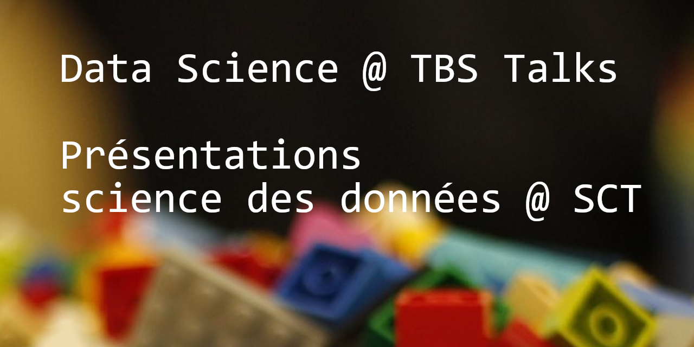

# Data Science Talks @ TBS
These files are in support of the Data Science Talks series at the Treasury Board of Canada Secretariat. Each folder corresponds to a talk, and contains corresponding notebooks, slides and code. Issues and Pull Requests welcome!

## Schedule

* **Using Git Version Control**: Friday February 21st, 2020
  - Join us for an introduction to the git version control tool
  - 219 Laurier 5002, 1:00 PM - 2:00 PM

### Past Presentations

* **[Identifying Data Science Projects](identifying_ds_projects/)**: Monday January 20th, 2020
  - In this talk, we will focus on how to: estimate the feasibility and financial value of potential projects, set up objectives and success criteria, and identify potential “dealbreaking” characteristics.
  - 90 Elgin 2023, 1:00 PM - 2:00 PM
* **Survey Analysis**: Monday December 16th 2019
  - Join us for an introduction to statistical survey analysis
  - 90 Elgin 2024, 11:00 AM - 12:00 PM
* **[PSES PowerBI - Lessons Learned](power_bi_lessons_learned/)**: Tuesday November 26th 2019
  - Last year, our team produced a PowerBI report on PSES data. We will be presenting lessons learned and tips to consider when developing a report for production
  - 219 Laurier 5002, 10:00 AM - 11:00 AM
* **Protected B Data Science Virtual Machine**: Friday October 25th 2019
  - We are excited to present updates and tools on the Protected B Data Science Virtual Machine
  - 219 Laurier 5002, 10:00 AM - 11:00 AM
* **[AI Fairness](fairness/)**: Monday September 30th 2019
  - Join us for an introduction and discussion into fairness in AI and analytics
  - 90 Elgin 2023, 11:00 AM - 12:00 PM
* **[Data Cleaning](data_cleaning/)**: Monday, August 26th 2019
  - Data is messy! Data cleaning is an important step in any data analysis or machine learning project. We will go over various problems you will encounter with real data and how to deal with them. Examples will be provided in R and Python but the main emphasis will be on the concepts.
  - Room 2025 at 90 Elgin St., 2:30 - 3:30 PM 

# Présentations science des données @ SCT
Ces fichiers sont en connexion à la série de présentations sur la science des données au Secrétariat du Conseil du Trésor du Canada. Chaque dossier correspond à une présentation et contient les blocs-notes, diapositive et le code correspondants. Questions et demandes d'addition de code sont les bienvenues !

## Horaire

### Présentations précédentes

* **[Identifier des projets de science des données](identifying_ds_projects/)** : Lundi 20 janvier 2020
  - Dans cette présentation, nous nous pencherons sur la façon d'estimer la faisabilité et la valeur financière de projets potentiels, d'établir des objectifs et des critères de succès, et d'identifier les caractéristiques potentielles qui bloqueraient le projet.
  - 90 Elgin 2024, 13 h 00 - 14 h 00
* **Analyse de sondage** : Lundi 16 décembre 2019
  - Joignez-vous à nous pour une introduction à l'analyse statistique de données provenant de sondages
  - 90 Elgin 2024, 11 h 00 - 12 h 00
* **[Power BI SAFF - Leçons apprises](power_bi_lessons_learned/)**: Mardi 26 novembre 2019
  - L'an dernier, notre équipe a produit un rapport Power BI sur les données du SAFF. Nous présenterons les leçons apprises et les conseils à prendre en considération lors de l'élaboration d'un rapport mis en production.
  - 219 rue Laurier 5002, 10 h 00 - 11 h 00
* **Machine virtuelle de science des données Protégé B**: Vendredi 25 octobre 2019
  - Nous sommes ravis de vous présenter les mises à jour et les outils de la machine virtuelle de science des données Protégé B
  - 219 rue Laurier 5002, 10 h 00 - 12 h 00
* **[Équité et l'IA](fairness/)**: Lundi 30 septembre 2019
  - Joignez-vous à nous pour une introduction et une discussion sur l'équité en matière d'IA et d'analyse.
  - 90 Elgin 2023, 11 h 00 - 12 h 00
* **[Nettoyage de données](data_cleaning/)**: Lundi 29 août 2019
  - Les données sont compliquées! Le nettoyage des données est une étape très importante dans n’importe quel projet d’analyse de données ou de l’apprentissage automatique. Nous discuterons plusieurs types de problèmes que vous rencontrerez avec les données réelles et comment les traiter. Exemples en R et Python serons disponibles mais l’accent sera sur les concepts.
  - Salle 2025 au 90 rue Elgin, 2:30 - 3:30 PM
